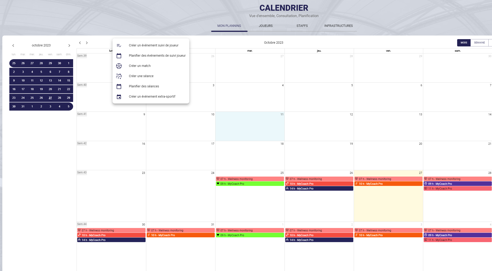

# Les différents types d'événements  
  
La création d'événements est un maillon essentiel de l'usage de MyCoach Pro.  
Le calendrier Myoach Pro **vous permet de créer et de planifier** différents types d'événements.  

## Liste des types d'événements disponibles

- **Événement de suivi joueur** (_1 type d'événement, plusieurs contextes._)
- **Séances d'entraînement**
- **Matchs**
- **Événement extra-sportif**  

  

### 1\. Les Événements de suivi joueur  
  
Ce type d'événement est étroitement lié aux questionnaires (voir section Insights > Questionnaires), il **permet de proposer un questionnaire à vos joueurs** attribué a **l'un des différents contextes**, en dehors d'un événement sportif (séance ou match).  
  
La **création / planification** de ce type d'événement est possible **uniquement depuis le calendrier**. 
  

#### Liste des types d'événements disponibles:

- _Administratif_
- _Entretien individuel_
- _État de forme_
- _Nutrition_
- _Paramédical_
- _Préparation mentale_
- _Psychologie_
- _Autres_

### 2\. Les séances d'entraînement  

Vous pouvez **créer ou planifier vos séances d'entraînement** depuis le calendrier (Cette foncitonnalité est également disponible depuis le module **Séances**). Différents types de séances sont disponibles afin de les programmer avec précisions.
  
Tout comme pour les événements de suivi joueurs, vous pouvez **convoquer vos joueurs**, **proposer un questionnaire avant ou après l'événement** si vous en avez créer un pour le **contexte séance** depuis le module **Insights > Questionnaire**.

