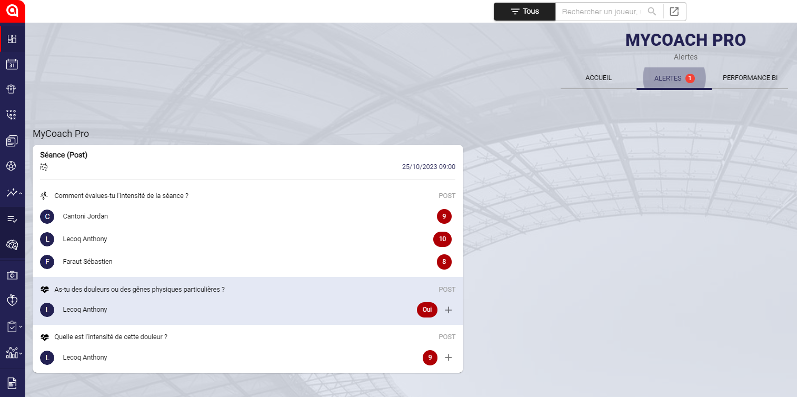
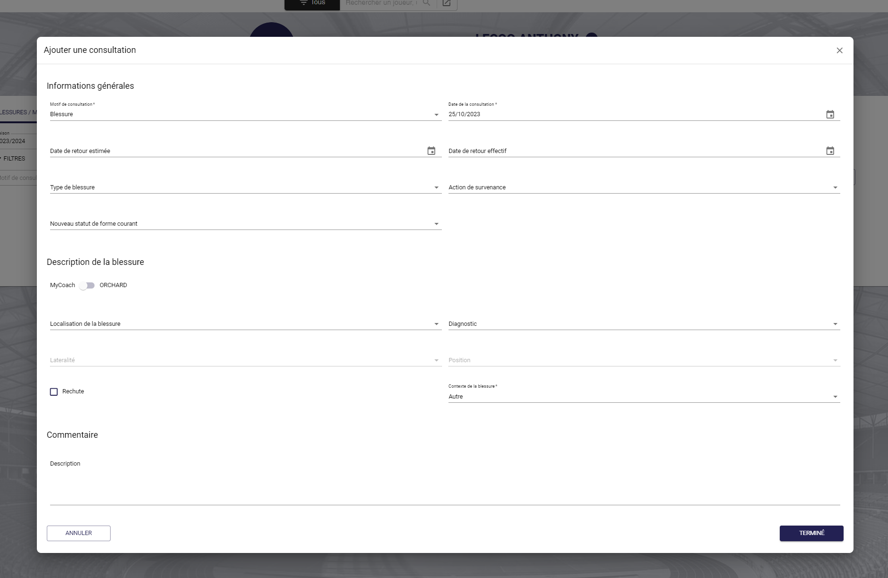
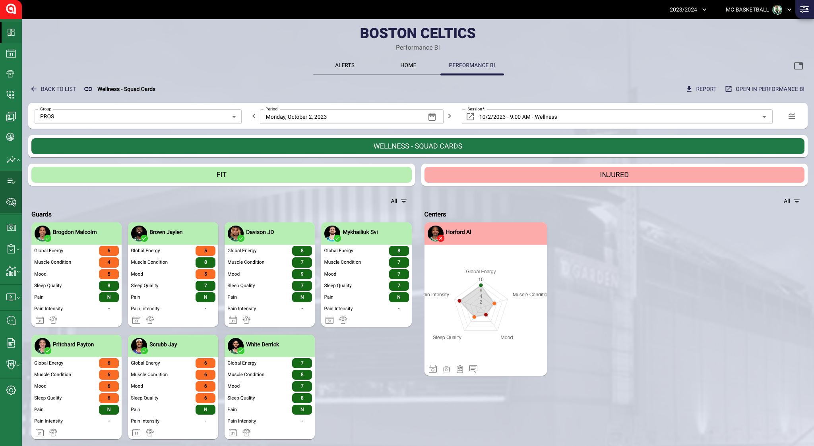
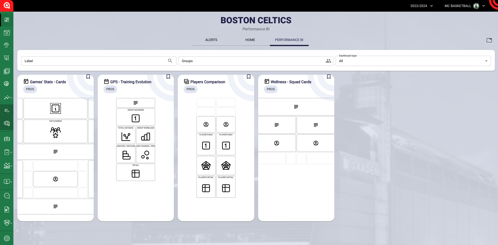
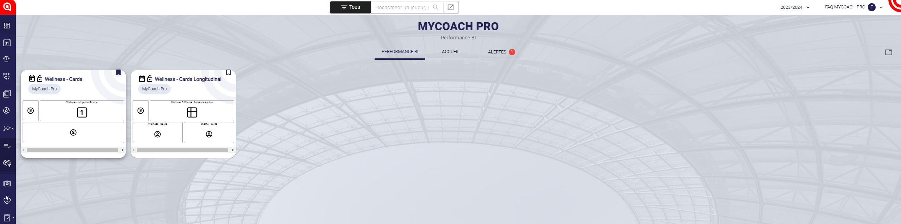

# Introduction
## _Connaître l'accueil en 5 min_  
  

L'accueil est votre premier contact avec MyCoach Pro lorsque vous vous connectez, nous l'avons donc rendu personnalisable par chaque utilisateur afin qu'il corresponde a vos besoin.

Vous y trouverez 3 onglets: **ACCUEIL**, **ALERTES** et **PERFORMANCE BI**. Ces derniers sont configurables et peuvent être placer dans l'ordre que vous souhaiter, apparaître, ou bien être masqués.

### **1\. Accueil**

Ce dernier vous permet de configurer différents widgets afin de personnaliser votre expérience.  
Chaque utilisateur peut avoir son propre accueil. 

#### **_Liste des widgets disponibles:_**  

- Calendrier
- 5 dernières séances
- Liens
- Dashboards favoris
- Media center
- Prochaines séances
- Raccourcis
- Etats de forme
- Evénements suivi joueur
- Evénements suivi joueur de l'équipe
- Dynamique de l'équipe
- Joueurs suivis
- Notes du dernier match
- Prochaines séances par équipe
- Top buteurs
- Top passeurs
- Post-it
- Anniversaires
- Actualités
- Actualités du club  
  
***

### **2\. Alertes**

L'onglet alertes vous permet d'observer les alertes déclenchées par vos joueurs lorsque ces derniers répondent à une question, par une réponse comportant une alerte.  
En cas de blessure, **vous aurez par exemple la possibilité de créer une consultation médicale**. (nécessite des droits spécifiques sur le compte.)

***

### **3\. Performance BI**  
  
Lorsque vous ajouter à un **dashboard Performance BI**, le contexte accueil, il apparaîtra directement dans cet onglet.  

  

Si plusieurs Dashboards ont ce contexte, la liste apparaîtra comme ci-dessous:  

  
  
Vous pourrez toutefois définir un dashboard par défaut pour cette vue en cliquant sur le bouton indiqué.

  
